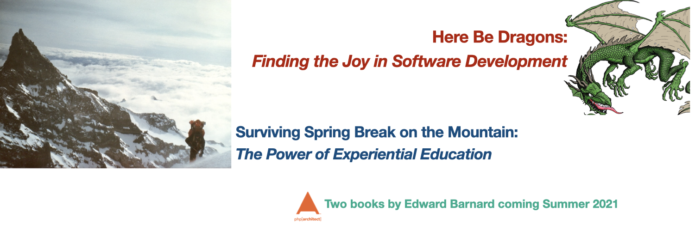

# Here Be Dragons: Finding the Joy in Software Development

[Click Here for slide deck as PDF](slide-decks/2021-04-midwest-php-dragons.pdf) for offline viewing.
*Use the "download" button if it says "something went wrong".*

There's a strong tendency toward "gate keeping" right now in the 2020s. Senior developers warn "there be dragons" while
announcing a "hands off" policy toward the crucial areas of the code base. You and I need to get past that. Where's the
fun when you can't touch the dragons? The joy's in _experiencing_ software development, dragons and all.

## About Edward Barnard

Ed has experienced two 20-year careers in software development. He soldered together his first computer from a handful
of resistors, diodes, switches, and lights in 1968 at age 10. He taught himself FORTRAN IV two years later. High School
brought BASIC. College introduced Algol, assembly language, and Pascal. Ed's first career was writing operating system
software for Cray Research and the world's fastest computers. His second career has been web software development for
countless clients, companies, and projects. Ed and wife Susan have a new hobby: camping the Minnesota winter, allowing
them to get back outdoors with no mosquitoes.

## About the Books

Who ever looked at a software problem and exclaimed, "Hey, let's have fun with this!" But that's just what I do.

I see software development as having fun with technically difficult material. I discovered it's far more appealing to
gain any level of mastery when I already have plans to have fun with that mastery.

What's different about my approach, and why do you care? I looked back over my own 50+ years of "playing with computers"
to find what I did differently from others, discern how I built a career and had a great time doing it. I created two
books to meet you where you are and guide your own development from here.

* Book One, *Here Be Dragons: Finding the Joy in Software Development* asks, "How do you develop *yourself* as a
  software developer?" How do you become the expert over and over again, year after year? How do you keep this *fun*?
  Here's your path to solve this once and for all.

* Book Two, *Spring Break on the Mountain: The Power of Experiential Education* shares the physical and emotional
  aspects of life preparation. I took an unusual path, and *this* is the path which proved to be the right foundation
  for my own career.

## About "Here Be Dragons: Finding the Joy in Software Development"

Developing real skill, to the point of mastery, requires deliberate practice. You can't get that from a book. However, a
book *can* act as a guide. In the mountaineering world, for example, guidebooks share the experience of climbers who
have climbed the route before you. They tell you what you need to know, but *you* still need to climb the route
yourself. A guidebook's information may be indispensable, but the book won't carry you up the mountain.

There's a skill we *can* practice right here in the book. We'll be taking deep dive after deep dive to learn how it
really was or learn how something works "under the covers." I'll do my best to make things heavy going while keeping it
fun. For my part I'm having fun providing you the challenge!

### Part I: Fun Takes Skill

At Cray Research we built the world's fastest computers. Period. We all saw that mission as larger than ourselves. Being
pioneers we *expected* to have to find our own way, and we did.

That attitude's as important as the willingness to learn and find solutions. In sharing what that world was like, I'm
sharing that attitude. We'll meet some useful skills along the way such as double buffering and cache locality. I'll
show you the technique I call "finding patterns in the noise." It's paid off countless times. We'll have fun with an
actual game of horseshoes inside a spotless computer room at NSA (U.S. National Security Agency) headquarters, but don't
tell anyone!

* Chapter 1. My NSA Mug Shot
* Chapter 2. It Was Nothing, They Said
* Chapter 3. Big Iron
* Chapter 4. Vacuum Tube Blackjack
* Chapter 5. The Cray Style
* Chapter 6. Chased by the Bad Guys

### Part II: Low-Level Thinking

Here are some hard-core skills rarely seen these days except amongst people who develop compilers or write
microcontrollers for robotics, aircraft avionics, or the like. Certainly there are bragging rights available to those
who can do shifting and masking in their heads. But we're heading for something far more important, more fundamental,
more subtle.

The real skill is learning how a computer "thinks," to identify with how things work *from the computer's perspective.*
Other skills are important, absolutely, but this is foundation on which you can build the rest. I'm providing you the
path distilled from my 50 years' experience with computers.

* Chapter 7. The Fizz Buzz Fix
* Chapter 8. Profile of the "Real Programmer"
* Chapter 9. Think Like a Computer
* Chapter 10. The Basics With a Side of Crypto
* Chapter 11. Design an Algorithm in Your Head
* Chapter 12. Turtles All the Way Down
* Chapter 13. Deep Dive

### Part III: High-Level Thinking

We software developers can easily lose the forest for the trees, so to speak. It can be just as tricky to think about
any software system as a whole rather than focusing on some specific part. If you use a banking app on your phone, for
example, it's natural to focus on what you see displayed on the phone screen. As the app developer you would naturally
focus on that same screen's functionality.

However, we also need to consider the impact of millions of such screens being used simultaneously. We'll practice this
higher level, more abstract, way of thinking.

* Chapter 14. The Poker Player
* Chapter 15. When the World Shifts
* Chapter 16. Machine Learning and Yoda
* Chapter 17. Abstract Thinking
* Chapter 18. Imposter Syndrome

### Part IV: Ethical Thinking

The Silicon Valley and Seattle "Big Tech" conglomerates have become too big to succeed. Ethics and other moral values
have lost their relevance. Now, in the early 2020s, U.S. States' Attorneys General are lining up with antitrust
complaints. The powerful 19th Century transcontinental railroads provide the announced game plan for sorting out Silicon
Valley. That fact is weird, so naturally we'll take a deep dive and have fun with it!

* Chapter 19. Silicon Valley Takedown
* Chapter 20. Transcontinental Railroad
* Chapter 21. The Train Wreck
* Chapter 22. Incipient Battles
* Chapter 23. Safe Havens Then and Now

## About "Surviving Spring Break on the Mountain: The Power of Experiential Education"

I learned the concept of Experiential Education directly from World War II veteran and mountaineer Willi Unsoeld, a
leading founder of that philosophy. I'll share his hilarious tryout for the first U.S. expedition to the top of Mount
Everest. Then I'm bringing you to my own winter summit of Mount Rainier, a feat as rare today as it was back then.

That sounds weird for a book on developing a software career. Unsoeld's wife Jolene placed this in perspective for me
decades later: it's learning to *experience* the journey that makes it special, that creates a career, that surfaces the
joy amongst the dragons. Success only comes with planning and serious preparation; only experience brings mastery of the
craft. That lesson, I believe, remains the same whether it's on a mountain or in front of a keyboard or whiteboard.

* Chapter 1. Jolene's Story
* Chapter 2. The Mountain
* Chapter 3. College Spring Break
* Chapter 4. Planning, Preparation, and Practice
* Chapter 5. Mastering the Craft

